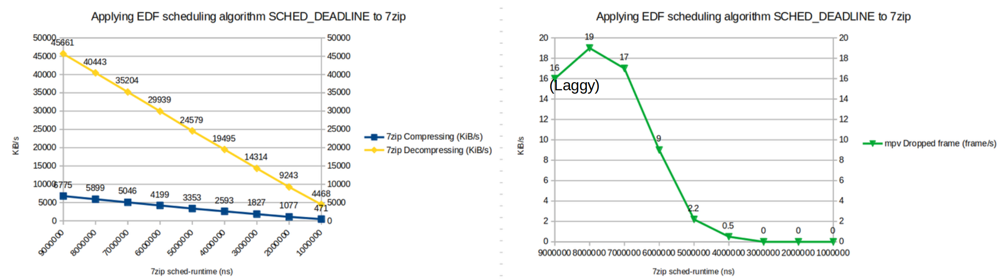
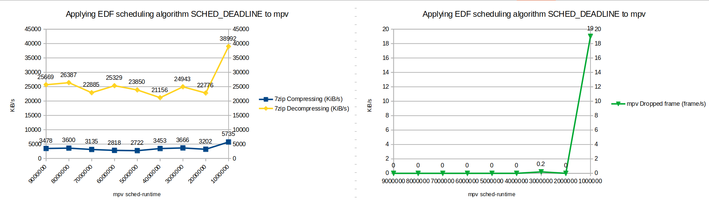

# Real Time System Project 1

> Group 13 
B09902069 李昆昱

## Linux Scheduling Policy Testing and Analysis

### 0. Testing design

There are 3 parameters when configuring EDF Scheduling by `chrt` :

- sched-runtime
- sched-deadline
- sched-period

We assume that deadline = period = $10^{-2}s=10000000 ns$

There are two CPU sensitive program running simultaneously: 

- 7zip benchmark
    
    `7z b 100 -md16`
    
- mpv video player
    
    `mpv --loop=inf --autofit=100%x480 Period.mp4`
    

### 1. Applying default scheduling algorithm `SCHED_OTHER`:

- 7zip benchmark
Compressing ≈ 3600 KiB/s
Decompressing ≈ 26000 KiB/s
- mpv video player
Drop frame = 0

### 2. Applying EDF scheduling algorithm `SCHED_DEADLINE` to 7zip:



After applying `SCHED_DEADLINE` real-time algorithm, 7zip benchmark process would consume as much CPU resource during runtime.

- When sched-runtime decreases, benchmarks score decreases.
- When sched-runtime is high, mpv can’t get enough resource, causing frame drops.

### 3. Applying EDF scheduling algorithm `SCHED_DEADLINE` to mpv:



- Since mpv only consumes fixed amount of CPU resource, it wouldn’t affect either process when sched-runtime of mpv > 2000000. 7zip benchmark would take away the remaining CPU resource.
- When sched-runtime of mpv < 1000000, mpv have no enough resource, causing frame drops. 7zip benchmark have much more remaining CPU resource, which lead to better performance.

### 4. Applying EDF scheduling algorithm `SCHED_DEADLINE` to 7zip & mpv:

We can only set:

- 7zip benchmark
    - sched-runtime = 1000000
    - sched-deadline & sched-period = 10000000
    - CPU Usage 10%
- mpv video player
    - sched-runtime = 1000000
    - sched-deadline & sched-period = 5000000
    - CPU Usage 20%

The system declares that “resourse is busy” in order to avoid **unschedulable (CPU Usage > 100%).**

## Short description on kernel compilation steps

```bash
# After code modification
cd ~/linux-5.15.71
make
sudo mv /boot/initrd.img-5.15.71 ~/backup/ # Due to insufficient storage space
sudo make install
```

There is no need for `sudo make module_install` because we didn’t modify module files.

## Code tracing on deadline scheduler

> Modify the kernel to print a message whenever scheduling parameters are changed (e.g., by chrt) for a task.

- We find two possible function in `kernel/sched/deadline.c` that may be called when calling sched_setattr() :
    - `bool dl_param_changed(struct task_struct *p, const struct sched_attr *attr)`
    - `void __setparam_dl(struct task_struct *p, const struct sched_attr *attr)`
    
    I insert `printk` to both function and recompile. After reboot, I found that only `__setparam_dl` function was called when calling chrt. 
    
- Hence, I add the following line into `__setparam_dl` function to print out the info message when the EDF parameter changed:
    
    ```bash
    printk("SCHED_DEADLINE parameters set on pid %d: runtime=%lld, deadline=%lld, period=%lld\n", p->pid, attr->sched_runtime, attr->sched_deadline, attr->sched_period);
    ```
    
- After compile and reboot, it works like a charm 😀